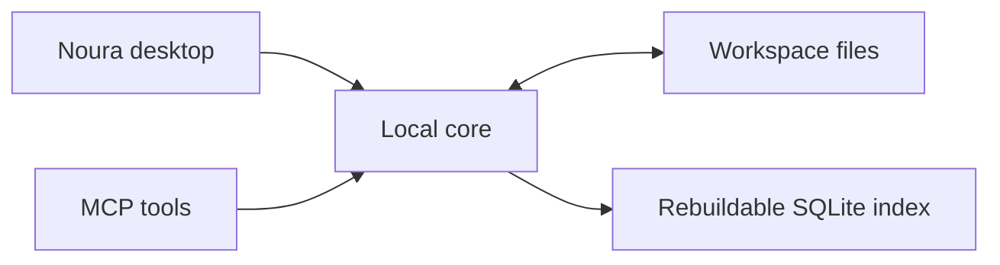

# Noura

The open workspace for humans and AI.

Noura is an open-source, local-first desktop workspace where everything is a plugin. Combine notes, tasks, projects, and AI chat in one workspace. Keep your work in ordinary files you can edit, back up, and use without Noura.

[](#try-noura)
[](https://github.com/lobbystack/noura/actions/workflows/ci.yml)
[](LICENSE)

[Try Noura](#try-noura) · [Documentation](#documentation) · [Contribute](#contributing)

## A workspace built from plugins

Notes, tasks, projects, calendar, folders, and AI are first-party plugins. Choose the combination you need for each workspace in **Settings**.

Start with notes for writing, then add tasks and projects to organize the work around them. Turn plugins on or off without deleting their files. Plugins use [shared capabilities](docs/architecture/plugin-runtime.md#capabilities) to work with your files and contribute commands or AI context.

## Work in one workspace

Write project notes, track tasks, and give your AI assistant context from the same workspace:

- **Notes**: write and edit Markdown
- **Tasks and projects**: track priorities, due dates, and progress on project boards
- **Calendar**: view scheduled work by month, week, or day
- **Search**: find content across your workspace with full-text search
- **AI chat**: connect your provider, choose workspace context, and approve tool actions
- **External AI tools**: read and update notes and tasks through [Model Context Protocol (MCP)](https://modelcontextprotocol.io/docs/getting-started/intro)

## Keep control of your work

Use Noura alongside your existing tools:

- **Open files**: keep notes, tasks, projects, and chat history as Markdown with structured metadata
- **Local use**: read and edit your workspace offline, without a Noura account or hosted service
- **External editing**: edit, move, and rename files with other tools; review conflicts when changes overlap
- **AI permissions**: choose your provider and authorize sending workspace content before an in-app AI request
- **Credentials**: Noura stores provider credentials in your operating system’s credential store

## Try Noura

Run the desktop app from source. Install these prerequisites:

- [Bun](https://bun.sh/docs/installation) 1.3.14
- [Rust](https://www.rust-lang.org/tools/install) 1.91 or newer
- [Tauri 2 platform prerequisites](https://v2.tauri.app/start/prerequisites/) for your operating system

```sh
git clone https://github.com/lobbystack/noura.git
cd noura
bun install
bun run tauri dev
```

Create a workspace, add a note, and open the note’s Markdown file in your editor.

## Develop Noura

Run the development checks from the repository root:

```sh
bun run check
bun run test
bun run build
bun run format:check
```

Follow the [desktop verification guide](docs/testing/local-alpha-acceptance.md) for the full checks and workspace workflows.

To work on the marketing website, start its development server:

```sh
bun run dev:website
```

Open `http://127.0.0.1:5174` in your browser.

## How Noura stores your workspace

Your workspace is a folder with a [manifest](docs/workspace-format/v1.md#manifest) at `.noura/workspace.yaml`. Notes, tasks, projects, and chats use Markdown with structured metadata in [frontmatter](docs/workspace-format/v1.md#managed-markdown). You can move or rename a file without changing its stable identifier.

Noura commits workspace files to disk before reporting a successful change. You can rebuild its SQLite search index and metadata cache from those files. The desktop app and MCP server use the same Rust services:



Read the [workspace format](docs/workspace-format/v1.md) for file layouts and the [local-core architecture](docs/architecture/local-core.md) for write and recovery behavior.

## Repository structure

Start with the directory for the part you want to work on:

| Directory                                                             | Purpose                                                                        |
| --------------------------------------------------------------------- | ------------------------------------------------------------------------------ |
| [`apps/app`](apps/app)                                                | SvelteKit and Svelte 5 application interface                                   |
| [`apps/website`](apps/website)                                        | Marketing website                                                              |
| [`apps/server`](apps/server) and [`apps/server-web`](apps/server-web) | Sync service, account pages, and share viewer                                  |
| [`packages`](packages)                                                | Typed workspace client, shared types, editor, AI runtime, and plugin contracts |
| [`crates/local-core`](crates/local-core)                              | Rust file operations, validation, indexing, watching, and credentials          |
| [`crates/mcp-server`](crates/mcp-server)                              | MCP adapter over local-core services                                           |
| [`plugins`](plugins)                                                  | First-party workspace modules                                                  |
| [`src-tauri`](src-tauri)                                              | Tauri 2 desktop shell and native bridge                                        |

## Documentation

Start with the [documentation guide](docs/README.md), or use these references for implementation details:

- [Workspace format](docs/workspace-format/v1.md)
- [Local-core architecture](docs/architecture/local-core.md)
- [AI runtime and permissions](docs/architecture/ai-runtime.md)
- [Plugin capabilities](docs/architecture/plugin-runtime.md)
- [Desktop verification guide](docs/testing/local-alpha-acceptance.md)
- [Server setup](apps/server/README.md)

## Contributing

Read the [contributor conventions](AGENTS.md) before changing code. Keep pull requests focused, include tests for behavior changes, and run the development checks.

For workspace-format changes, update the shared [conformance fixtures](docs/workspace-format/fixtures/) so Rust and TypeScript accept the same files.

## Support and security

Use [GitHub issues](https://github.com/lobbystack/noura/issues) for questions, bug reports, and feature requests. Follow the [security policy](SECURITY.md) to report a vulnerability.

## License

Noura uses the [MIT license](LICENSE). See [third-party notices](THIRD_PARTY_NOTICES.md) for dependency attributions.
