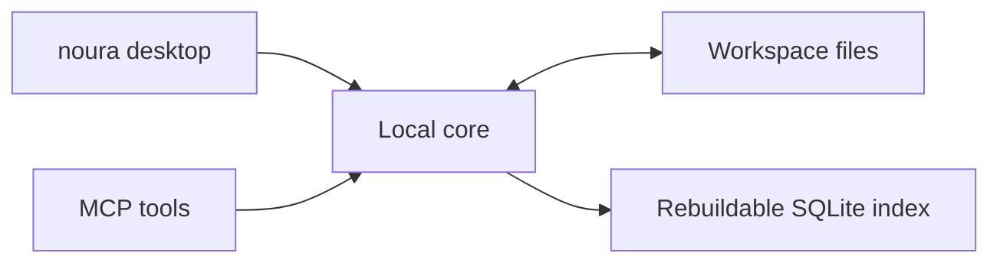

# noura

The open workspace for humans and AI.

noura is an open-source, local-first desktop workspace for notes, tasks, projects, and AI chat. Keep your work in ordinary files you can edit, back up, and use without noura.

[](#try-noura) [](https://github.com/lobbystack/noura/actions/workflows/ci.yml) [](LICENSE)

[Try noura](#try-noura) · [Documentation](#documentation) · [Contribute](#contributing)

## A workspace built from plugins

Files and the Markdown editor are always on. Tasks, projects, calendar, and AI are first-party plugins: choose the ones each workspace needs in **Settings**.

Start with notes for writing, then add tasks and projects to organize the work around them. Turning a plugin off leaves its files in place. Plugins use [shared capabilities](docs/architecture/plugin-runtime.md#capabilities) to work with your files and contribute commands or AI context.

## Work in one workspace

Write project notes, track tasks, and give your AI assistant context from the same workspace:

- **Notes**: write and edit Markdown
- **Tasks and projects**: track priorities, due dates, and progress on project boards
- **Calendar**: view scheduled work by month, week, or day
- **Search**: find content across your workspace with full-text search
- **AI chat**: connect your provider, allow it to read workspace content, and approve each tool action
- **External AI tools**: read and update notes and tasks through [Model Context Protocol (MCP)](https://modelcontextprotocol.io/docs/getting-started/intro). noura doesn't ask before each MCP action, so connect only tools you trust

## Keep control of your work

Use noura alongside your existing tools:

- **Open files**: keep notes, tasks, projects, and chat history as Markdown with structured metadata
- **Local use**: read and edit your workspace offline, without an account or hosted service
- **External editing**: edit, move, and rename files with other tools; review conflicts when changes overlap
- **AI permissions**: choose your provider and authorize sending workspace content before an in-app AI request
- **Credentials**: noura stores provider credentials in your operating system’s credential store

## Try noura

Download the installer for macOS, Windows, or Linux from [noura.app](https://noura.app/#download) or the [releases page](https://github.com/lobbystack/noura/releases). noura is an early alpha, so keep backups of important files.

To run the desktop app from source, install these prerequisites:

- [Bun](https://bun.sh/docs/installation) 1.3.14
- [Rust](https://www.rust-lang.org/tools/install) 1.91 or newer
- [Tauri 2 platform prerequisites](https://v2.tauri.app/start/prerequisites/) for your operating system

```sh
git clone https://github.com/lobbystack/noura.git
cd noura
bun install
bun run tauri dev
```

Create a workspace, add a note, and open the note’s Markdown file in your editor.

## Develop noura

The browser workspace build also requires the Rust Wasm target and the wasm-bindgen CLI version that matches the Rust dependency:

```sh
rustup target add wasm32-unknown-unknown
cargo install wasm-bindgen-cli --version 0.2.127 --locked
```

Run the development checks from the repository root:

```sh
bun run check
bun run test
bun run build
bun run format:check
```

Follow the [desktop verification guide](docs/testing/local-alpha-acceptance.md) for the full checks and workspace workflows.

To work on the marketing website, start its development server:

```sh
bun run dev:website
```

Open `http://127.0.0.1:5174` in your browser.

## How noura stores your workspace

Your workspace is a folder with a [manifest](docs/workspace-format/v1.md#manifest) at `.noura/workspace.yaml`. Notes, tasks, projects, and chats use Markdown with structured metadata in [frontmatter](docs/workspace-format/v1.md#managed-markdown). You can move or rename a file without changing its stable identifier.

noura commits workspace files to disk before reporting a successful change. You can rebuild its SQLite search index and metadata cache from those files. The desktop app and MCP server use the same Rust services:


```mermaid
flowchart LR
    desktop["noura desktop"] --> core["Local core"]
    tools["MCP tools"] --> core
    core <--> files["Workspace files"]
    core --> index["Rebuildable SQLite index"]
```

Read the [workspace format](docs/workspace-format/v1.md) for file layouts and the [local-core architecture](docs/architecture/local-core.md) for write and recovery behavior.

## Repository structure

Start with the directory for the part you want to work on:

| Directory | Purpose |
| --- | --- |
| [`apps/app`](apps/app) | SvelteKit and Svelte 5 interface for the desktop app, account pages, share viewer, and experimental browser workspace |
| [`apps/website`](apps/website) | Marketing website |
| [`apps/server`](apps/server) | Experimental sync service that hosts the browser build of `apps/app` |
| [`packages`](packages) | Typed workspace client, shared types, editor, AI runtime, and plugin contracts |
| [`crates/local-core`](crates/local-core) | Rust file operations, validation, indexing, watching, and credentials |
| [`crates/mcp-server`](crates/mcp-server) | MCP adapter over local-core services |
| [`plugins`](plugins) | First-party workspace modules |
| [`src-tauri`](src-tauri) | Tauri 2 desktop shell and native bridge |

## Documentation

Start with the [documentation guide](docs/README.md), or use these references for implementation details:

- [Workspace format](docs/workspace-format/v1.md)
- [Local-core architecture](docs/architecture/local-core.md)
- [AI runtime and permissions](docs/architecture/ai-runtime.md)
- [Plugin capabilities](docs/architecture/plugin-runtime.md)
- [Desktop verification guide](docs/testing/local-alpha-acceptance.md)
- [Server setup](apps/server/README.md)

## Contributing

Read the [contributor conventions](AGENTS.md) before changing code. Keep pull requests focused, include tests for behavior changes, and run the development checks.

For workspace-format changes, update the shared [conformance fixtures](docs/workspace-format/fixtures/) so Rust and TypeScript accept the same files.

## Support and security

Use [GitHub issues](https://github.com/lobbystack/noura/issues) for questions, bug reports, and feature requests. For anything else, email [hello@noura.app](mailto:hello@noura.app). Follow the [security policy](SECURITY.md) to report a vulnerability.

## License

noura uses the [MIT license](LICENSE). See [third-party notices](THIRD_PARTY_NOTICES.md) for dependency attributions.
